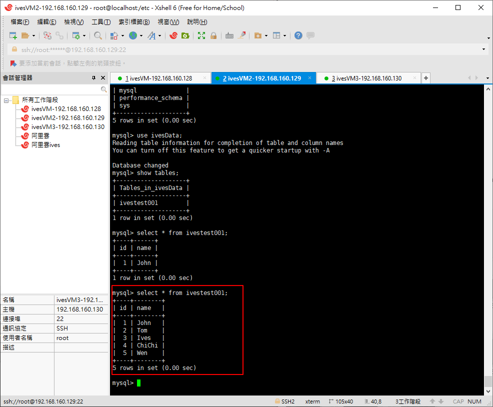

# MySQL 實現主從複制

# 準備兩台虛擬機

主機： ivesVM - 192.168.160.128

(因為ivesVM環境較雜，後面的示範會改用ivesVm3)

(主機： ivesVM3 - 192.168.160.130)

從機： ivesVM2 - 192.168.160.129


# 查看有沒有安裝MySQL

```bash
rpm -qa|grep -i mysql
find / -name mysql
```

# 刪除存在的mysql文件

find有找到的話，需要移除

```bash
rm -rf /xxxxx
```
# 安裝

可參考之前的筆記，關於mysql安裝的部分

一樣要先確定系統有無安裝mysql，有的話若版本符合可直接使用，若版本不符合則需要移除再重新安裝

https://github.com/IvesShe/PHP_FPM_Nginx_MySQL_Redis

語法可參考這篇

https://github.com/IvesShe/MySQL_Study


主機ivesVM(原先已安裝過)


從機ivesVM2安裝完成


## 這邊記錄一些不同之處

關於密碼的部分，可以使用另外一種方式，實現免密碼登錄

因為主機已經用原本的方式設定過了，這裡設定分機

```bash
vi /etc/my.cnf
```

在開始加入一行，跳過授權(忽略密碼)

```bash
skip-grant-tables
```


重啟mysql服務器

```bash
service mysqld restart
```


登入成功(輸入密碼處直接按enter)

```bash
mysql -uroot -p
```


# 相關命令

啟動mysql服務器

```bash
service mysqld start
```

重啟mysql服務器

```bash
service mysqld restart
```

查看MYSQL運行狀態

```bash
systemctl status mysqld.service
```

# 設置密碼

刷新權限

```bash
flush privileges;
```

設置密碼

```bash
alter user 'root'@'localhost' identified by '123456';
```

刷新權限

```bash
flush privileges;
```


# 將my.cnf密碼跳過取消

```bash
vi /etc/my.cnf
```

刪掉原先加的這行

```bash
skip-grant-tables
```

需要使用密碼登入了

```bash
mysql -uroot -p123456
```


# 實現mysql的主從複制


以下開始為：

主機： ivesVM3 - 192.168.160.130

從機： ivesVM2 - 192.168.160.129


# 在主服務及從服務器創建要同名稱的數據庫

```bash
create database ivesData;
```

```bash
show databases;
```


# 先配置主服務器
```bash
# 修改配置文件
vi /etc/my.cnf
```

添加以下的內容

```bash
# 日誌文件的名字
log_bin=master-a-bin
# 日誌文件的格式
binlog-format=ROW
# 服務器的id，一定要是唯一的
server-id=1
# 對應需要實現主從複制的數據庫
binlog_do_db=ivesData
```


# 添加完之後需要登入主服務器給從服務器授權

```bash
# grant replication slave on *.* to '帳號'@'從服務器主機位址' identified by '密碼';

# 單一台
grant replication slave on *.* to 'root'@'192.168.160.129' identified by '123456';

or 

# 192.168.160.XXX都適用
grant replication slave on *.* to 'root'@'192.168.160.%' identified by '123456';
```

刷新系統權限表

```bash
flush PRIVILEGES;
```


## 再配置從服務器

```bash
# 修改配置文件
vi /etc/my.cnf
```

添加以下的內容

```bash
# 日誌文件的名字
log_bin=master-a-bin
# 日誌文件的格式
binlog-format=ROW
# 服務器的id，一定要是唯一的
server-id=2
# 對應需要實現主從複制的數據庫
# 雙主互相備份(表示從服務器可能是另外一台服務器的主服務器)
# binlog_do_db=ivesData
```


# 驗證主從複制

```bash
# 重啟主服務器和從服務器
service mysqld restart

or  

systemctl mysqld restart
```

登入主服務器

```bash
mysql -uroot -p123456
```

查看主服務器的狀態

```sql
show master status;
```


- File
生成的日誌文件名

- Position 
文件名所處的一個位置(偏移量)

- Binlog_Do_DB
需要實現主從複制的數據庫


# 設置從服務器如何找到主服務器


## 設置主從複制的日誌和偏移量

登入從服務器

根據實際的數值填入對應的位置

```sql
change master to
master_host='192.168.160.130',master_port=3306,master_user='root',master_password='123456',master_log_file='master-a-bin.000001',master_log_pos=154;
```


啟動slave的數據同步

```sql
start slave;
```

查看slave的配置信息

```sql
show slave status\G;
```


停止slave的數據同步(參考)

```sql
stop slave;
```

# 主要觀察

- Slave_IO_State
- Slave_IO_Running(要Yes)
- Slave_SQL_Running(要Yes)

# 若從機連不上主機，可能原因

1. 防火牆的問題
2. 端口未開放
3. 未授權

# 防火牆相關指令

```bash
# 查看
firewall-cmd --list-all
# 開啟
firewall-cmd --add-port=3306/tcp --permanent
# 重啟
firewall-cmd --reload

```

# 從服務器若查看到的數據庫數量不對，主服務器需授權客戶端

登入主服務器

with grant options不僅僅是授與增刪改查的權限，還授與權限的權限

```sql
grant all privileges on *.* to root@'192.168.160.%' identified by '123456' with grant option;
```

出現報錯 


主服務器若授權報錯時，要查看目前密碼的格式要求

```sql
select @@validate_password_policy;

show variables like 'validate_password%';
```


### 主服務器降低數據庫密碼格式的要求

```sql
set global validate_password_policy=0;
set global validate_password_mixed_case_count=0;
set global validate_password_number_count=3;
set global validate_password_special_char_count=0;
set global validate_password_length=3;
```

再次查看，降為low了

```sql
show variables like 'validate_password%';
```


## 主服務器再重新授權


```sql
alter user 'root'@'localhost' identified with mysql_native_password by '123456';
```

```sql
flush privileges;
```

```sql
grant all privileges on *.* to root@'192.168.160.%' identified by '123456' with grant option;
```

```sql
flush privileges;
```


## 重啟從服務器的服務

```bash
stop slave;
start slave;
show slave status\G;
```


# 主服務器添加表及數據，檢查從服務器是否同步

```sql
show databases;

use ivesData;

create table ivestest001(id int primary key auto_increment,name varchar(20) not null)charset='utf8';

show tables;
```


查看從服務器

```sql
show databases;

use ivesData;

show tables;
```

已成功的從主服務器更新到ivestest001表的數據了!!


## 在主服務的ivestest001表中插入數據測試

```sql
insert into ivestest001 values(null,'John');

select * from ivestest001;
```


在從服務器查看

```sql
select * from ivestest001;
```


主服務再多插入幾筆測

```sql
insert into ivestest001 values(null,'Tom');
insert into ivestest001 values(null,'Ives');
insert into ivestest001 values(null,'ChiChi');
insert into ivestest001 values(null,'Wen');

select * from ivestest001;
```


在從服務器查看

```sql
select * from ivestest001;
```



# 小結

1. 確實實現了高可用
2. 但是主服務器掛掉之後，如何實現從服務器的自由切換?
3. 從服務器除了備份數據，基本上沒有其它作用，並沒有分擔主才服務器的壓力
4. 寫數據時非常的耗時的操作(基本上是讀數據的100倍以上)
5. 下個課題 - 讀寫分離
